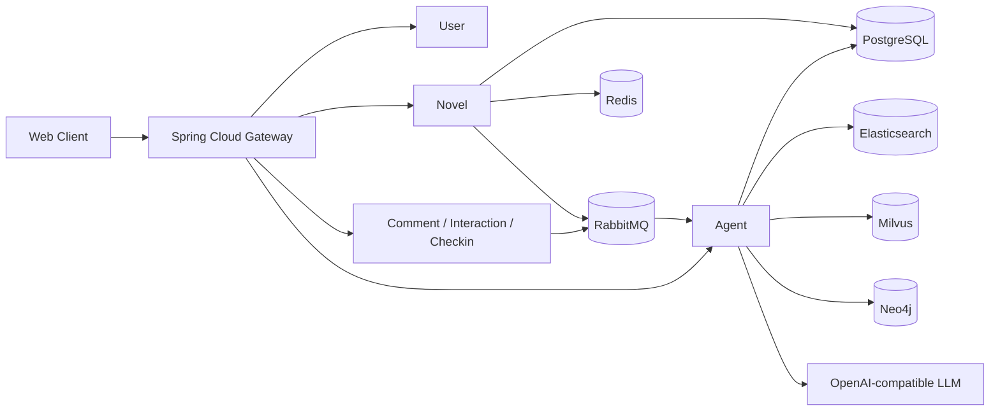

# 善阅坊 Reader

> 一个面向中文网络小说的多书源阅读平台与 AI 阅读助手。
>
> 从外部书源接入、连续阅读状态到防剧透 LightRAG，关注的是“读者已经读到哪里”和“系统能为此提供哪些有证据的帮助”。

## 项目亮点

| 能力 | 解决的问题 | 实现要点 |
| --- | --- | --- |
| 多书源阅读 | 同书多源、规则不统一、换源丢进度 | Legado 规则引擎、`canonicalBookId`、聚合搜索、换源、正文指纹复用 |
| 阅读社区 | 书架、进度、互动和榜单状态分散 | 书架/收藏/进度、评论评分、等级积分、Redis ZSet 排行榜 |
| 异步可靠性 | 打卡统计与知识构建拖慢请求、任务中断 | RabbitMQ、持久任务账本、原子抢占、重试、DLQ、启动恢复 |
| AI 阅读助手 | 普通 RAG 容易剧透、上下文膨胀、图谱难以追溯 | 阅读边界 LightRAG、局部图、证据引用、关系断言与审核状态 |
| 模型接入 | 不同模型提供方、BYOK、流式会话与工具越权 | Spring AI、OpenAI-compatible、AES 密钥加密、SSE 恢复、只读工具白名单 |

## 它能做什么

- 导入和管理书源，完成小说搜索、目录读取、正文阅读；兼容 HTML/JSON 规则、常见字符编码和部分复杂规则。
- 聚合同一作品的多个书源：读者按“作品”而不是单个书源管理书架、收藏和阅读进度，并可切换当前书源。
- 提供书架、收藏、阅读进度、阅读时长、评论评分、点赞、签到、等级积分与阅读排行榜。
- 在已读章节边界内提供 AI 问答、剧情回顾、人物关系、线索、阅读洞察、角色访谈和书架建议。
- 支持平台模型和 OpenAI-compatible BYOK 配置；模型密钥加密存储，回答支持 SSE 流式输出与刷新后会话恢复。

## 架构概览



### 服务边界

| 服务 | 职责 |
| --- | --- |
| `reader-gateway` | 统一路由、Sa-Token 鉴权、可信用户身份和 Agent 请求头透传 |
| `reader-user` | 注册登录、用户资料、等级与积分基础能力 |
| `reader-novel` | 书源规则、聚合搜索、规范作品、书架收藏、阅读进度、排行、封面 |
| `reader-comment` | 评论和评分 |
| `reader-interaction` | 点赞、收藏等互动事件 |
| `reader-checkin` | 签到与任务事件 |
| `reader-agent` | 模型路由、会话、LightRAG、图谱、线索、知识构建和离线评测 |

## 核心设计

### 多书源不是“隐藏重复卡片”

多个书源的同一本书通过 `canonicalBookId` 归并为规范作品。书架、收藏、阅读进度、章节内容版本以及 Agent 知识数据均关联到规范作品；书源只负责当前目录和正文的获取渠道。

```text
多个书源结果 -> 规范作品 canonicalBookId
                       |- 书架 / 收藏 / 阅读进度
                       |- 当前书源与换源记录
                       `- 内容版本 / RAG 索引 / 图谱
```

正文进入知识构建前会先规范化并计算 SHA-256 指纹。内容未发生实质变化时复用既有索引，避免换源或重复抓取导致重复向量化和图谱构建。

### 防剧透 LightRAG

LightRAG 的硬边界是服务端记录的阅读进度，而不是依赖提示词要求模型“不要剧透”。所有证据、图谱、线索、引用和只读工具查询都按作品和已读章节过滤。

1. 从当前问题和已读章节内的已审核实体定位种子；
2. 在 Neo4j 中扩展一至两跳的局部关系，限制边数；
3. 组合 PostgreSQL 权威证据、Elasticsearch 关键词召回、Milvus 语义召回与本地重排；
4. 以卡片数、字符数和 Prompt Token 预算约束上下文；
5. 局部证据不足时才回退到有限章节窗口，不将整书图谱或整书摘要直接塞入模型。

PostgreSQL 保存章节、关系断言、审核状态与任务记录等权威数据；Elasticsearch、Milvus、Neo4j 是可重建的检索投影。向量、图或重排依赖异常时，系统可回退到关系库/全文证据，而不应直接中断回答。

### 可审计图谱与异步知识任务

模型抽取的关系不会直接写入读者图谱，而是先保存为关系断言：包含来源章节、逐字 evidence、哈希、置信度、模型版本和审核状态；通过证据门禁后才投影节点和边。

图谱构建、章节索引和 Embedding 重建均通过 RabbitMQ 处理。任务先持久化到数据库，再发布消息；消费者以原子 claim 抢占任务，配合持久队列、重试、死信队列和启动恢复，处理至少一次投递下的重复消息与提交-投递间隙。构建进度按章节抽取、人物校准、事件、线索、RAG 刷新、投影和收尾等阶段持久化。

## 技术栈

- **服务端**：Java 17、Spring Boot 3、Spring Cloud Gateway、Nacos、OpenFeign、MyBatis-Plus、Sa-Token、Flyway。
- **数据与中间件**：PostgreSQL、Redis、RabbitMQ、MinIO、Elasticsearch、Milvus、Neo4j。
- **AI 工程**：Spring AI、OpenAI-compatible API、LightRAG、本地/可选外部 Reranker、SSE、结构化关系抽取。
- **前端与运行环境**：Vue 3、Vite、Pinia、Cytoscape.js、Docker Compose、PowerShell。
- **可观测性**：Actuator、Micrometer Prometheus、OpenTelemetry/OTLP 配置；Jaeger 作为可选本地追踪后端。

## 快速开始

### 环境要求

- JDK 17
- Maven 3.9+
- Node.js 20+
- Docker Desktop（Docker Compose）
- PowerShell 7 推荐；Windows PowerShell 也可运行启动脚本

### 1. 配置本地环境

复制环境模板：

```powershell
Copy-Item .env.example .env
```

至少为本地 Agent 填写随机且足够长的 `AGENT_ENCRYPTION_KEY`、`AGENT_INTERNAL_TOKEN` 和 `AGENT_GATEWAY_TOKEN`。需要真实模型问答、图谱抽取或语义 Embedding 时，再填写模型 API Key 和相应模型配置。

> `.env`、API Key、内部令牌和用户自定义模型密钥不得提交到仓库。默认 `hash` Embedding 仅用于无密钥开发兜底，不代表真实语义检索效果。

### 2. 一键启动

```powershell
pwsh -NoProfile -File scripts/start-all.ps1
```

脚本按“Docker 中间件 -> 后端服务 -> 前端”的顺序启动。首次启动后端时，可按提示选择是否先执行 Maven 打包。

也可以分步执行：

```powershell
pwsh -NoProfile -File scripts/start-middleware.ps1
pwsh -NoProfile -File scripts/build-backend.ps1
pwsh -NoProfile -File scripts/start-backend.ps1
pwsh -NoProfile -File scripts/start-frontend.ps1
```

### 3. 常用地址

| 组件 | 地址 |
| --- | --- |
| 前端 | `http://localhost:3000` |
| API Gateway | `http://localhost:8080` |
| Agent 健康检查 | `http://localhost:8086/actuator/health` |
| Nacos | `http://localhost:8848/nacos` |
| RabbitMQ 管理台 | `http://localhost:15672` |
| MinIO 控制台 | `http://localhost:9001` |
| Prometheus | `http://localhost:9090` |
| Jaeger（可选） | `http://localhost:16686` |

检查运行状态或停止本地服务：

```powershell
pwsh -NoProfile -File scripts/check-status.ps1
pwsh -NoProfile -File scripts/stop-all.ps1
```

## 构建、测试与评测

后端完整测试：

```powershell
Set-Location backend
mvn test
```

前端生产构建：

```powershell
Set-Location frontend
npm ci
npm run build
```

运行固定《剑来》前 100 章的 RAG 结构与检索评测：

```powershell
pwsh -NoProfile -File scripts/evaluate-jianlai-rag-quality.ps1 `
  -Round round-5-final `
  -EvaluateRetrieval
```

评测脚本保存结构化指标与短失败样例，不输出 API Key，也不额外复制大段小说正文。该专项语料只用于离线评测，不是运行时的角色名或章节规则来源。

## 验证结果与边界

- Agent Surefire 测试产物共 42 份、137 个测试，统计为 `failures=0`、`errors=0`、`skipped=0`。
- 固定《剑来》前 100 章离线基准的五轮迭代中，检索 Recall@5 从 `22.22%` 提升到 `88.89%`，MRR 从 `0.0778` 提升到 `0.6574`。该结果仅代表固定语料、标注与模型配置。
- 本地单实例、3 秒窗口的排行榜缓存读在 100 并发下为 `3247.33 QPS`、p95 `48.21 ms`；书源分页和外部书源搜索仍是已识别的性能短板。
- 项目已提供 Prometheus 指标与 OTLP 配置；默认 tracing 采样关闭，尚未把 Jaeger 看板或生产级链路运营作为完成结论。

## 文档导航

| 主题 | 文档 |
| --- | --- |
| 整体技术方案 | [项目整体技术方案](docs/项目整体技术方案.md) |
| 整体设计 | [项目设计](docs/project-design.md) |
| Agent 架构计划 | [小说智能体架构计划](docs/novel-agent-architecture-plan.md) |
| Agent 实现与验收 | [小说智能体工作内容详解](docs/小说智能体工作内容详解.md) / [全量验收报告](docs/小说智能体计划全量验收报告.md) |
| RAG 跨书泛化 | [跨书泛化 RAG 三轮架构迭代报告](docs/跨书泛化RAG三轮架构迭代报告.md) |
| 《剑来》专项知识库 | [目录说明](docs/jianlai-knowledge-base/README.md) / [五轮迭代报告](docs/jianlai-knowledge-base/剑来前100章RAG五轮自适应迭代报告.md) |
| 性能基线 | [单实例接口压测完整报告](docs/单实例接口压测完整报告-2026-08-05.md) |
| 求职与面试材料 | [目录说明](docs/resume/README.md) |

## 目录结构

```text
Reader/
├─ backend/                       Spring Cloud 微服务
│  ├─ reader-gateway/             网关与认证边界
│  ├─ reader-novel/               书源、作品、阅读与排行
│  ├─ reader-agent/               LightRAG、图谱与模型会话
│  └─ ...
├─ frontend/                      Vue Web 客户端
├─ docker/                        PostgreSQL、Redis、MQ、ES、Milvus、Neo4j 等 Compose 配置
├─ scripts/                       启动、验证、评测与压测脚本
├─ docs/
│  ├─ jianlai-knowledge-base/     《剑来》专项知识与评测资料
│  └─ resume/                     简历、项目复盘与面试材料
└─ perf/                          JMeter 压测方案
```

## 当前状态

善阅坊是一个持续演进的个人项目，适合学习、作品展示与技术复盘。外部书源稳定性、跨书图谱精度、Agent 长稳压测和追踪告警仍有继续完善空间；欢迎通过 Issue 提出问题或交流实现思路。

## License

本仓库当前未声明开源许可证。引用、二次分发或商用前，请先联系仓库维护者确认授权范围。
