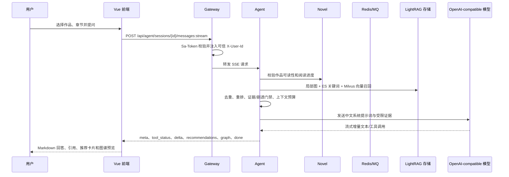
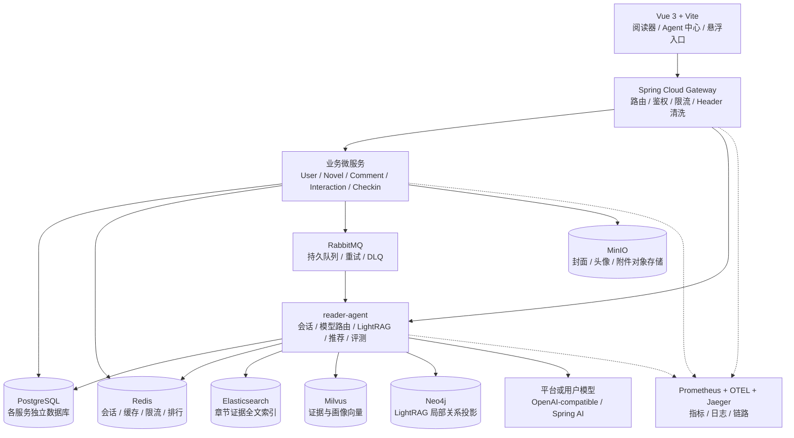
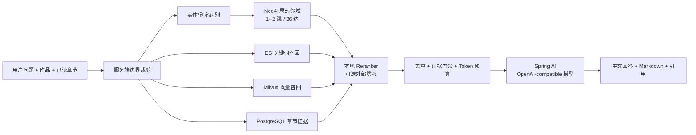
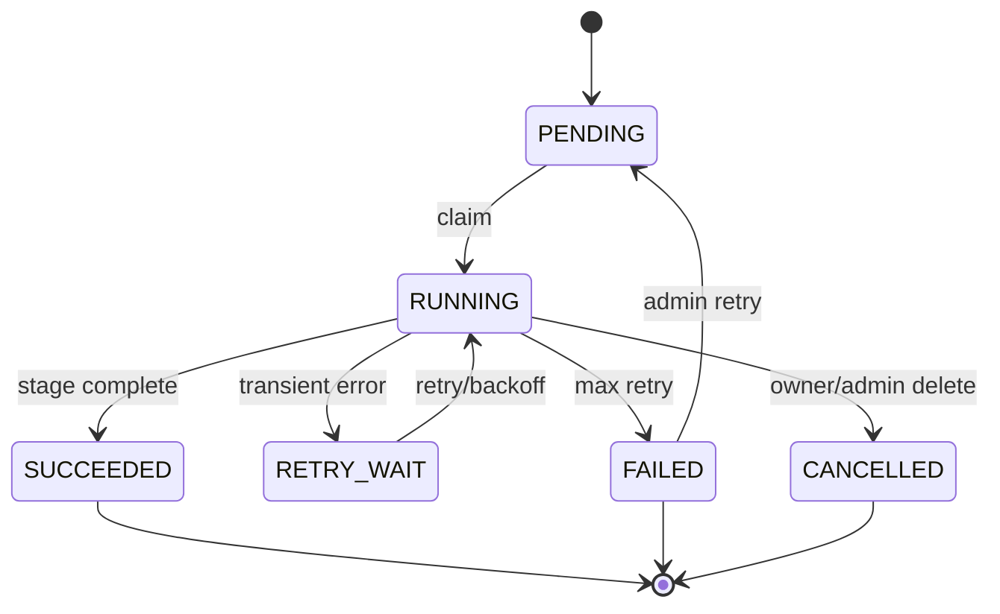

# 善阅坊（Reader）项目整体技术方案

> 文档版本：V1.0
>
> 编制日期：2026-08-25
>
> 文档状态：交付评审基线
>
> 适用范围：Reader 全站、小说阅读、书源接入、社区能力与小说智能体

## 1. 文档说明

### 1.1 编制目的

本文档以可交付、可评审、可部署、可验收为标准，说明 Reader 项目的产品边界、技术架构、核心链路、数据模型、接口约定、可靠性与运维方案。它既是开发和测试的共同依据，也是部署、问题排查、技术面试和后续迭代的基线。

文档中的“已实现”以当前代码、迁移脚本、测试和 Docker 配置为准；“交付要求”描述生产环境必须满足的工程约束。两者不一致时，以“差距与风险”章节登记，不通过模糊描述掩盖未完成项。

### 1.2 阅读对象

| 角色 | 关注内容 |
| --- | --- |
| 产品/业务 | 用户场景、功能边界、剧透规则、验收标准 |
| 后端开发 | 服务边界、数据模型、事件链路、接口和幂等 |
| 前端开发 | 页面入口、状态流转、SSE 协议、错误与降级 |
| 算法/Agent 开发 | LightRAG、证据链、提示词、模型路由和评测 |
| 测试 | 功能、质量、性能、安全、故障注入验收 |
| 运维/交付 | 部署拓扑、配置、监控、备份、恢复和发布 |

### 1.3 术语

| 术语 | 定义 |
| --- | --- |
| 规范作品（`canonicalBookId`） | 将不同书源中同一本书归并后的稳定作品主键，书架、进度和知识索引均以它为业务归属。 |
| 书源 | 提供搜索、详情、目录和正文规则的外部内容来源；书源不是作品主键。 |
| 已读边界 | 服务端根据用户阅读进度计算出的允许使用的最大章节，所有问答和洞察证据必须受其约束。 |
| 原文证据 | 从章节正文中切分的、保留章节与字符位置的可追溯文本片段。 |
| LightRAG | 以实体/关系为入口进行局部图扩展，并与原文多路检索交叉验证的轻量知识增强架构。本项目只采用 LightRAG，不保留 GraphRAG 的全图社区摘要主链路。 |
| 投影 | 将 PostgreSQL 中的权威数据同步到 Elasticsearch、Milvus、Neo4j 等可重建检索存储。 |
| 知识构建任务 | 由用户或管理员发起、持久化并异步执行的章节索引、洞察和图谱任务。 |

## 2. 项目定位与目标

### 2.1 产品定位

善阅坊是面向中文网络小说的多书源阅读平台，同时提供一个理解“作品、读者阅读进度和书架偏好”的小说智能体。平台将“找书”和“读懂书”放在同一条链路中：用户可以从搜索、书架或阅读器进入 Agent，得到有章节依据、可跳转、受剧透边界保护的回答。

### 2.2 核心目标

1. **稳定阅读**：兼容 Legado 规则书源，完成作品归一、目录、正文、封面、换源和阅读进度连续性。
2. **可解释智能**：回答必须能够回指规范作品、章节和证据片段；推荐结果必须能映射到平台可读书源。
3. **无剧透体验**：回答、图谱、线索、回忆胶囊和阅读地图均按用户已读边界裁剪，越界时由服务端拦截并由前端提示确认。
4. **可扩展模型**：平台模型与用户自定义 OpenAI-compatible 模型并存，支持流式会话、连接测试、模型路由、灰度和成本记录。
5. **可运营交付**：异步任务可恢复、可重试、可审计；系统具备指标、日志、链路追踪、评测门禁和发布回滚能力。

### 2.3 非目标与明确边界

- 不在本项目中实现通用搜索引擎、付费订阅或积分充值商城。
- Agent 默认只读；加入书架、收藏、移动书架等写操作必须由用户在 UI 中显式确认。
- 不将整书正文、整书图谱或全局社区摘要直接放入 Prompt。
- 不使用规则/正则直接生成可见人物关系；可见关系必须来自模型抽取、枚举门禁和原文证据审核。
- 不把本项目描述为 GraphRAG。Neo4j 只承载 LightRAG 的局部邻域查询与关系投影，Milvus 只承载向量召回。

### 2.4 当前交付状态

| 能力域 | 当前状态 | 交付说明 |
| --- | --- | --- |
| 阅读与书源 | 已实现 | 书源导入/转换、聚合搜索、规范作品、目录正文、封面、换源和进度链路已具备；外部书源仍需持续健康检查。 |
| 社区与用户 | 已实现 | 登录、书架、收藏、评论、评分、点赞、签到、积分、等级和排行榜已拆分服务实现。 |
| Agent 双入口 | 已实现 | `/agent` 独立中心和全站悬浮入口均存在；复杂洞察与知识图谱管理使用独立页面。 |
| 会话与模型 | 已实现 | 会话持久化、编辑/导出/删除、SSE 恢复、平台模型、BYOK、连接测试、模型启停和密钥加密已实现。 |
| LightRAG 检索 | 已实现 | PostgreSQL 权威证据 + Elasticsearch + Milvus + Neo4j 局部图 + 本地重排；外部重排模型为可选增强。 |
| 知识构建 | 已实现 | 正文补齐、章节增量索引、人物校准、关系断言、线索生命周期、任务进度、重试/DLQ、图谱审核和重建已具备。 |
| 推荐与阅读管家 | 已实现 | 书架续读、相似书、动态书架分组、阅读计划和反馈闭环已具备，推荐结果必须经过平台书源校验。 |
| 可观测性 | 已实现 | Actuator、Prometheus、OTLP/Jaeger、检索 Trace、Token/成本和降级指标已接入；生产告警阈值需按部署规模确认。 |
| 自动化交付 | 基础已实现 | Maven/前端构建、测试、Compose 校验和 RAG Benchmark 脚本已提供；生产镜像编排、密钥托管和跨机压测需在目标环境完成。 |

## 3. 用户场景与业务闭环

### 3.1 主要用户场景

| 场景 | 用户动作 | 系统结果 |
| --- | --- | --- |
| 搜索并阅读 | 输入书名/作者，选择来源 | 聚合书源，归并规范作品，展示详情和目录，创建/恢复阅读进度 |
| 悬浮问答 | 点击右下角 AI 入口并提问 | 在当前书和章节上下文中流式回答，返回证据和可点击引用 |
| 书籍洞察 | 选择书架作品和章节范围 | 检查正文覆盖范围；缺失时先创建补齐任务，再创建 LightRAG 知识构建任务 |
| 图谱探索 | 选择人物、地点、事件或关系类型 | 展示已读边界内的局部图，节点可聚焦、虚化、查看关系证据和原文 |
| 线索回顾 | 打开线索板/回忆胶囊 | 分开展示未解与已解线索，展示谜团、当前状态、证据章节和摘要，不直接堆原文 |
| 个性化推荐 | 询问“类似某书/适合我的书” | 模型先生成推荐意图与候选描述，再调用平台书源搜索和规范作品校验，返回可阅读卡片 |
| 书架整理 | 打开阅读管家 | 基于书架元数据生成相似书分组、阅读计划和续读建议；不擅自移动真实书架条目 |
| 自定义模型 | 保存 OpenAI-compatible 配置并测试 | 服务端加密保存密钥，验证 URL/模型/最小请求，失败不创建会话、不扣平台额度 |

### 3.2 端到端闭环



## 4. 总体技术架构

### 4.1 分层架构



### 4.2 服务边界

| 服务 | 端口/发现名 | 核心职责 | 数据归属 |
| --- | --- | --- | --- |
| `reader-gateway` | 8080 / `reader-gateway` | 统一入口、路由、认证、可信用户头注入、内部服务边界 | 无业务库 |
| `reader-user` | 8081 / `reader-user` | 注册、登录、资料、头像、等级、经验、积分、模型密钥关联 | `db_user` |
| `reader-novel` | 8082 / `reader-novel` | 书源规则、搜索、详情、规范作品、目录正文、封面、书架、进度、排行 | `db_novel` |
| `reader-comment` | 8083 / `reader-comment` | 评论、评分、审核状态 | `db_comment` |
| `reader-interaction` | 8084 / `reader-interaction` | 点赞、收藏、互动事件 | `db_interaction` |
| `reader-checkin` | 8085 / `reader-checkin` | 签到、阅读时长资格、任务事件 | `db_checkin` |
| `reader-agent` | 8086 / `reader-agent` | 会话、模型、提示词、检索、LightRAG、知识任务、推荐和评测 | `db_agent` |

服务间只通过 Gateway 暴露浏览器接口；内部 Feign/HTTP 接口必须携带内部令牌。Agent 直接端口访问在部署过滤器中返回 404，避免绕过 Gateway 伪造 `X-User-Id`。

## 5. 前端架构与交互规范

### 5.1 页面结构

- **全局导航**：首页、书架、广场、排行榜、书源、Agent。Agent 只保留一个统一入口。
- **悬浮 Agent**：固定右下角，轻量对话、引用书架、当前阅读上下文、快捷插件和“进入 Agent 中心”。
- **Agent 中心**：对话工作台、书籍洞察、阅读管家、知识图谱管理、模型和隐私设置。
- **管理台**：仅管理员/操作员可见，配置模型路由、Prompt 版本、任务、图谱审核、评测和成本。

### 5.2 状态管理

Pinia 保存登录态和短期 UI 状态；会话、消息、模型配置、知识任务、进度均以后端为准。新建会话必须创建全新的服务端会话，不复用最近会话的作品引用；刷新页面通过会话 ID 恢复消息和生成状态。

SSE 使用 `meta`、`tool_status`、`delta`、`recommendations`、`graph`、`done`、`error` 事件。前端必须：

1. 对 `delta` 增量拼接并使用 Markdown 渲染器和 DOMPurify 安全清洗；
2. 对结构化推荐/图谱事件单独渲染，不能从模型 Markdown 中猜 JSON；
3. 断线后读取已持久化消息，不能重复扣费或重复创建回答；
4. 401 只展示错误并保留登录态，只有明确的认证失效才执行登出。

### 5.3 视觉和可用性要求

采用浅色纸张体系、明确文字对比度和响应式布局；洞察模块使用 Tab/切换面板避免整页纵向堆叠；知识图谱支持全屏画布、类型筛选、选中节点高亮及无关节点淡化/隐藏；进度条文字必须在填充和未填充区域均可读。所有 AI 生成内容显示来源、时间、章节边界和降级状态。

## 6. 领域模型与数据设计

### 6.1 规范作品与书源

```text
BookSource（来源规则）
    -> SourceBook（来源中的书）
    -> CanonicalBook（规范作品 canonicalBookId）
        -> CanonicalChapter（规范章节与正文版本）
        -> UserBookshelf / ReadingProgress
        -> AgentDocument / EvidenceChunk / GraphAssertion
```

规范作品匹配优先使用书名、作者、来源规范化和人工确认；正文版本使用内容规范化后的 SHA-256、章节号、书名/作者等元数据组合。乱码或广告变化不能让整本索引失效：章节级内容指纹、版本表和相似度校验允许复用未变化章节，仅对变化章节增量重建。

### 6.2 Agent 核心实体

| 实体 | 关键字段 | 约束 |
| --- | --- | --- |
| `agent_session` | `id,user_id,title,canonical_book_id,current_chapter,version,status` | 用户隔离；乐观锁更新 |
| `agent_message` | `session_id,role,content,generation_status,model,token_usage` | 只允许会话拥有者访问；生成可恢复 |
| `agent_model_config` | `user_id,base_url,model_name,encrypted_api_key,enabled` | 仅 OpenAI-compatible；密钥不可回显 |
| `agent_document/chunk` | `canonical_book_id,chapter_no,content_hash,offset,embedding_version` | 章节级幂等与版本复用 |
| `knowledge_relation_assertion` | `subject,relation_type,object,evidence,chapter_no,confidence,review_status` | 枚举关系、逐字证据、审核门禁 |
| `knowledge_clue` | `question,status,resolution,evidence_range` | `UNRESOLVED/RESOLVED` 均保留谜团和证据 |
| `book_knowledge_build_task` | `owner,book,start_chapter,end_chapter,stage,status,progress` | 持久任务账本、用户可删除本人任务 |
| `retrieval_trace` | `request_id,query_hash,route,hit_counts,latency,degrade_reason` | 脱敏，不保存 API Key 和整段正文 |

PostgreSQL 是事实源；ES、Milvus、Neo4j、Redis 均为可重建投影或缓存。任何删除、重建和审核操作必须保留操作人、时间、请求号和结果。

### 6.3 用户隔离

所有会话、模型、积分、偏好、书架和私有图谱查询均以网关注入的用户 ID 为条件。服务端丢弃外部提交的 `X-User-Id`，不信任前端携带的用户身份。公共知识只在 `is_public=true` 且通过作品可读性检查后共享；私有知识只能由创建者读取和删除。

## 7. 小说内容与书源技术方案

### 7.1 Legado 规则适配

书源导入保留原始 `sourceJson`，同时转换为项目字段：搜索规则、详情/目录 URL、目录规则、正文规则、替换正则和编码策略。运行时支持 HTML/JSON 规则、详情页独立目录页、正文广告清洗和章节缓存失效。

书源验收必须依次通过：搜索命中、书名/作者存在、封面 URL 存在且可访问、目录有效、首章正文长度达到阈值、正文编码和章节号连续。正文可读但作者/封面缺失的源只标记为“字段不完整”，不能默认启用；成人或风险来源默认禁用。

### 7.2 阅读链路

1. 前端请求聚合搜索；Novel 服务并行查询启用书源。
2. 结果按书名/作者归一到 `canonicalBookId`，返回源列表和可用性。
3. 用户选择作品后读取目录，记录当前源和最近阅读章节。
4. 正文请求先查章节缓存，再调用规则引擎；内容规范化后写入版本账本和 MinIO（若需持久化）。
5. 进度以规范作品为主键保存，换源不丢进度；Agent 上下文只携带服务端确认的作品和章节。

## 8. Agent 与 LightRAG 方案

### 8.1 设计原则

- **中文优先**：系统提示词、工具说明、错误信息和最终回答默认中文；模型输出必须包含事实、证据和不确定性说明。
- **证据优先**：没有章节证据就回答“不足以判断”，禁止凭空补全。
- **边界优先**：先计算已读边界，再做检索和生成；模型不能覆盖服务端裁剪。
- **增量优先**：以章节内容哈希和 Embedding 版本判断复用，只索引新增/变化章节。
- **局部优先**：只查询与问题实体相关的一至两跳邻域，默认最多 36 条边，不加载全书图。

### 8.2 LightRAG 检索流程



本项目不采用 GraphRAG 的“整本图谱社区摘要 -> 全局检索 -> 大上下文”路径。Neo4j 的节点和边是章节证据经审核后的投影；社区向量只作为 LightRAG 的局部辅助召回，不允许 `BOOK`/`BOOK_SAFE` 卡片进入问答上下文。Milvus/Neo4j 不可用时，按超时和失败冷却回退到 PostgreSQL + Elasticsearch，不阻断回答。

### 8.3 知识构建阶段

| 阶段 | 输入 | 输出 | 幂等键/门禁 |
| --- | --- | --- | --- |
| 内容准备 | 规范章节范围 | 正文补齐任务 | `book + range + contentHash` |
| 章节切分 | 章节正文 | EvidenceChunk | `chapter + hash + chunkerVersion` |
| Embedding | chunk 文本 | Milvus 向量 | `chunkHash + embeddingVersion` |
| 原子抽取 | 多章窗口 | 实体、地点、事件、线索候选 | 必须有章节和原文证据 |
| 人物校准 | 8 章窗口、2 章重叠、错位半窗口 | 别名归并、身份和关系 | 关系枚举、方向、证据门禁 |
| LightRAG 投影 | 审核断言 | Neo4j 节点/边、社区辅助向量 | 断言哈希和版本 |
| 质量评估 | 固定基准问题 | Recall/MRR、关系准确率、剧透违规率 | 未过门禁不发布 |

章节加载不会自动用正则生成可见图谱；用户确认洞察后才创建异步大模型构建任务。任务支持范围构建、断点恢复、失败重试、死信、删除和重新投影。重复执行不删除已验证断言，采用证据增量集合并。

### 8.4 提示词与输出协议

系统提示词包含角色、中文输出、用户阅读边界、证据使用、剧透政策、工具权限和失败回答模板。模型不得直接决定用户身份、章节边界或写操作。结构化能力通过 Spring AI Tool Calling / MCP 只读工具提供；推荐先由模型提出候选意图，再调用平台搜索校验，最终返回结构化推荐事件：

```json
{
  "title": "作品名",
  "author": "作者",
  "canonicalBookId": 123,
  "reason": "基于用户偏好和可见证据的理由",
  "readerLink": "/reader?...",
  "sourceVerified": true
}
```

JSON 只作为服务间协议，用户界面必须渲染为中文卡片和 Markdown，不把原始 JSON 直接展示给用户。

## 9. 模型、工具与成本控制

### 9.1 模型接入

统一采用 OpenAI-compatible 的 `baseUrl + model + apiKey` 格式，Spring AI 在请求级创建客户端，以支持平台 DeepSeek 模型和用户 BYOK。Base URL 仅允许 HTTPS、官方主机或管理员显式审核白名单；禁止 URL 凭据、查询串、片段、回环地址和私网地址。

模型配置密钥使用服务端 AES 密钥加密，日志、接口返回和导出均脱敏。连接测试为限流的最小 Token 探针，不创建会话、不写消息、不消耗平台额度。

### 9.2 积分与限流

- 新用户创建时发放 3 次平台模型试用额度。
- 之后平台模型调用扣除用户积分；BYOK 调用不扣平台额度，但仍受请求和并发限制。
- 积分流水以业务请求号幂等；签到和阅读资格使用 Redis/数据库双重约束防刷。
- 用户、IP、会话三层限流；同一会话默认只允许一个生成任务。
- 配置全局每日请求数和 Token 上限，超限返回可解释错误，不降级为无边界调用。

### 9.3 Prompt 预算

输入最大字符数、上下文 Token、输出 Token 均由配置限制；证据按相关性、章节范围、证据质量去重。记录供应商真实 Token 用量，供应商不返回时显式标记为估算，不把估算当作精确账单。

## 10. 异步任务与可靠性

### 10.1 消息链路

知识构建和正文补齐采用“先写数据库任务账本，再发布 RabbitMQ 消息”。消费者原子 claim 任务，完成阶段后更新进度并发布下一阶段。消息至少一次投递，因此消费者必须按任务 ID、阶段和版本幂等。



### 10.2 可靠性要求

- RabbitMQ 使用持久队列、手动确认、重试退避和 DLQ。
- 启动恢复扫描 `RUNNING` 超时任务并重新置为可抢占。
- 数据库提交与消息发布存在间隙时由补偿扫描重新发布。
- 删除任务和重建任务使用独立操作类型，不能把删除误投到索引队列。
- 外部模型、Milvus、Neo4j、Reranker 均设置连接/操作超时和失败冷却；降级路径必须打指标。

## 11. 接口与协议设计

### 11.1 浏览器接口分组

| 分组 | 代表接口 | 鉴权 |
| --- | --- | --- |
| 会话 | `POST /api/agent/sessions`、`GET /api/agent/sessions/{id}/messages`、`POST .../messages:stream` | 登录用户 |
| 模型 | `GET/POST /api/agent/models`、`POST /api/agent/models/{id}:test` | 配置所有者 |
| 推荐 | `POST /api/agent/quick-recommendations`、`POST /api/agent/recommendations/feedback` | 登录用户 |
| 洞察 | `GET /api/agent/books/{id}/graph|clues|timeline|reading-map|capsule|similar` | 作品可读用户 + 边界 |
| 构建 | `prepare`、`prepare-content`、`knowledge-build`、任务列表/删除 | 登录用户；所有者 |
| 隐私 | `GET/PUT /api/agent/preferences`、`DELETE .../personal-data` | 登录用户 |
| 管理 | `/api/agent/admin/**` | 持久化 ADMIN/OPERATOR RBAC |

统一返回 `code/message/timestamp/data`；参数错误、未登录、无权限、资源不存在、限流和上游失败必须使用稳定错误码。SSE 事件名和字段变更须向后兼容并增加协议版本。

### 11.2 内部接口

`/internal/agent/**` 仅允许服务间调用，必须校验内部令牌、作品和用户上下文；MCP Server 仅开放书籍搜索、书架、阅读进度和图谱只读工具，服务端强制 JSON-RPC 2.0 字段校验、`additionalProperties=false`、用户范围约束和调用审计。

## 12. 安全、隐私与合规

1. Gateway 是唯一浏览器入口；剥离用户自带 `X-User-Id` 后注入 Sa-Token 身份。
2. 所有写操作校验资源所有权；图谱共享必须由创建者显式设置公开。
3. API Key、内部令牌、数据库密码只来自环境变量/Secret，不提交 Git，不进入日志和 Prompt 账本。
4. Markdown 使用 DOMPurify；推荐链接只接受 Novel 服务返回的已验证 reader-link，禁止模型自造 URL。
5. 会话按保留天数清理，用户可删除个人对话和偏好；检索 trace 使用 query hash 和脱敏摘要。
6. 生产环境必须启用 TLS、数据库最小权限、Redis/MQ 密码、MinIO 独立账号、Neo4j 强密码和网络隔离。

## 13. 可观测性与运营

### 13.1 指标

| 指标类别 | 关键指标 |
| --- | --- |
| 流量 | API QPS、SSE 活跃数、按用户/IP限流次数 |
| 延迟 | Gateway、模型首 Token、完整回答、ES/Milvus/Neo4j p50/p95/p99 |
| 质量 | 检索 Recall@K、MRR、证据覆盖率、引用可跳转率、剧透违规率 |
| 任务 | 排队时长、阶段耗时、成功率、重试数、DLQ 数、覆盖章节数 |
| 成本 | 输入/输出 Token、估算标记、平台积分消耗、模型成本 |
| 降级 | 向量/图/重排 fallback、超时、熔断冷却 |

### 13.2 日志与追踪

每个请求携带 `requestId/traceId`；日志采用 JSON 结构，包含服务、接口、用户哈希、作品 ID、任务 ID、耗时和结果，不记录正文和密钥。OTLP 将 Agent 模型调用、工具调用、检索和重排串成一条链路；Prometheus 抓取 Actuator 指标，Jaeger 用于本地和预发布排查。

## 14. 部署与环境

### 14.1 环境分层

| 环境 | 用途 | 数据/模型策略 |
| --- | --- | --- |
| Local | 开发联调 | Docker Compose 全套中间件；可用 hash embedding；平台 Key 仅测试 |
| CI | 自动回归 | Testcontainers/固定 fixture；不访问真实小说和生产 Key |
| Staging | 交付验收 | 与生产拓扑一致；脱敏数据；真实模型配额受限 |
| Production | 正式服务 | 独立 Secret、TLS、备份、告警、限流和灰度发布 |

### 14.2 本地基础设施

Docker Compose 提供 PostgreSQL、Redis、RabbitMQ、Nacos、Elasticsearch、MinIO、Milvus、Neo4j、Prometheus、Jaeger 和 OTEL Collector。各服务通过 Nacos 注册/配置；数据库由 Flyway 迁移，当前 Agent 迁移已推进至 V43，部署时必须执行校验而非手工改表。

### 14.3 发布流程

```text
提交 -> 格式/敏感信息扫描 -> Maven 单测/集成测试 -> 前端 npm build
     -> Docker Compose 配置校验 -> RAG 离线评测门禁 -> 构建镜像
     -> Staging 冒烟/接口压测 -> 小流量灰度 -> 指标观察 -> 全量或回滚
```

发布包必须包含源码版本、数据库迁移、配置清单、镜像摘要、回滚版本和验证报告。任何 Prompt、模型路由或抽取器变更都要有版本号和评测结果。

## 15. 测试与验收标准

### 15.1 测试分层

- 单元测试：服务规则、边界裁剪、关系枚举、别名归并、积分幂等、限流和重试。
- 集成测试：PostgreSQL、Redis、RabbitMQ、ES、Milvus、Neo4j 适配与迁移。
- API/E2E：登录、书源搜索、阅读、Agent SSE、推荐跳转、图谱和权限隔离。
- 质量评测：固定《剑来》前 100 章和版权清晰的合成 fixture，评估召回、关系、线索、剧透和引用。
- 性能测试：JMeter/脚本分阶段压测，记录 QPS、并发、p95、错误率和资源峰值；不能把单一排行榜接口结果当成全站极限。
- 故障注入：暂停 Milvus/Neo4j、模型超时、RabbitMQ 重启、数据库连接失败，验证回退、重试和任务恢复。

### 15.2 交付门禁

| 门禁 | 建议阈值/结果 |
| --- | --- |
| 编译与测试 | Maven 全模块通过；前端生产构建通过；无阻断级 Checkstyle/依赖漏洞 |
| 功能 | 核心用户旅程 100% 通过；权限越权用例 0 个通过 |
| RAG | Recall@5、MRR、证据覆盖率达到评测基线；剧透违规为 0 |
| 稳定性 | SSE 完成率、任务最终成功率、DLQ 可恢复性达标 |
| 性能 | 在目标并发下 p95、错误率和 CPU/内存不超过容量预算 |
| 安全 | Secret 扫描、依赖扫描、SSRF/提示词注入/越权测试通过 |
| 可运维 | 健康检查、指标、日志、追踪、备份恢复演练均有记录 |

## 16. 容量与资源基线

单实例 Demo 可将所有 Java 服务部署在 8 核 16 GB 服务器上，但启用 ES、Milvus、Neo4j、Nacos、MQ 和可观测性后，建议至少 8 核 32 GB；生产起步建议将数据库、中间件和业务服务拆分，业务服务 4--8 核/实例，PostgreSQL 4 核 16 GB，ES 4 核 8--16 GB，Milvus 4 核 8--16 GB，Neo4j 2--4 核 4--8 GB，并根据章节规模、Embedding 维度和模型调用量实测扩容。该估算不是性能承诺，正式容量以压测报告和线上资源曲线为准。

## 17. 风险、降级与未闭环项

| 风险 | 影响 | 处置 |
| --- | --- | --- |
| 外部书源变更/限流 | 搜索或正文不可用 | 多源聚合、健康评分、缓存、失败源禁用和人工复核 |
| 模型超时/额度不足 | 回答失败或延迟 | BYOK/平台路由、超时、重试上限、降级模板和积分幂等 |
| 图/向量存储故障 | 检索质量下降 | PostgreSQL + ES 证据回退，指标标记 fallback |
| 抽取误判 | 图谱和线索不可信 | 证据门禁、关系枚举、审核状态、版本化重建和离线评测 |
| 章节乱码/版本漂移 | 索引重复或错配 | 章节级内容哈希、规范化、相似度校验和增量重建 |
| 单实例资源不足 | 延迟抖动/任务堆积 | 限流、任务并发上限、队列监控和拆分部署 |

交付前必须重新确认：生产 Secret 管理、真实模型与书源授权、外部 Reranker（可选）、跨服务分布式压测、备份恢复演练和告警阈值。这些属于部署环境证据，不应以本地 Demo 的通过结果替代。

## 18. 交付物清单

1. 前后端源代码、版本标签和变更记录。
2. Flyway 迁移、Docker Compose、Nacos 配置模板和 Secret 清单。
3. OpenAPI/Knife4j 接口文档、SSE/MCP 协议说明和错误码表。
4. 书源转换/扫描/验收报告及启用源规则包。
5. LightRAG 构建、重试、删除、审核和回滚操作手册。
6. Benchmark 数据、评测脚本、质量报告和性能压测报告。
7. 监控指标、日志字段、Trace 查询、告警规则和应急预案。
8. 部署手册、容量基线、备份恢复记录和上线验收单。

## 19. 评审结论模板

评审人应逐项记录“通过/有条件通过/不通过”，并附证据链接：

```text
版本：
环境：
数据库迁移版本：
模型/Prompt 版本：
功能验收：通过 / 有条件通过 / 不通过
RAG 质量门禁：通过 / 有条件通过 / 不通过
性能与资源：通过 / 有条件通过 / 不通过
安全与权限：通过 / 有条件通过 / 不通过
可观测性与恢复：通过 / 有条件通过 / 不通过
遗留问题与负责人：
上线/回滚结论：
```
